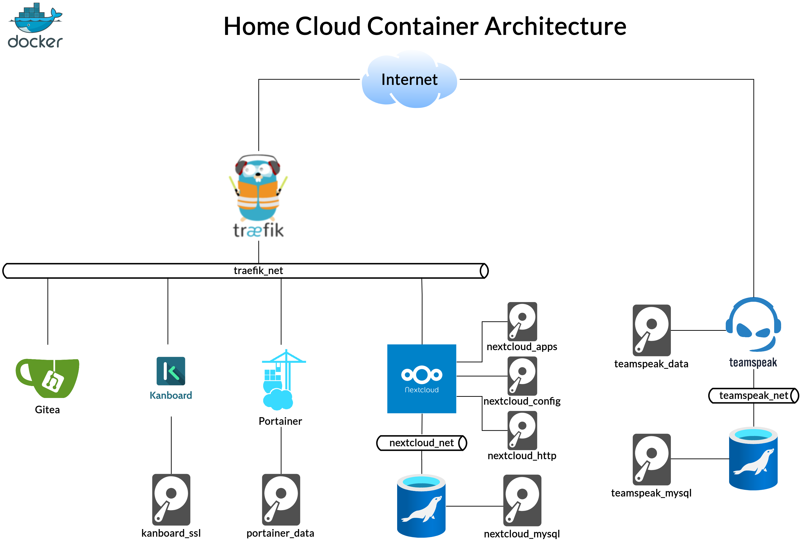

# Home Server Microservices Container Setup #

### 12/05/2020 ###

An at least two year delayed write up I wanted to do desperately is the one of
my home server. So this post covers which microservices are running on my private 
cloud and how the architecture is set up using container technology. We will also
cut into how my overall home network is setup device wise and we will state 
some things that still have to be improved.

The whole setup is contained in https://github.com/tbienias/home_cloud.
Feel free to use this as a reference or starting point.

##  Contents ##

[1. Requirements](#requirements)

[2. Network](#network)

[3. Containers](#containers)

[4. Suggested Improvements](#improvements)

[5. Conclusion](#conclusion)

##  Requirements ##

Home servers always fulfill certain demands. Here is a list with my personal must-haves:

* Long term maintained very stable version of OS
* Cloud storage synced to all devices
* Git repositories
* VoIP service
* Easy upgrades and smooth deployment
* SSH access
* Web services exposed via HTTPS only

###  Hardware ###

There should be no application which cannot be run on the server device. Be it
architecture- or performance-wise. So low end hardware, such as Raspberry Pi or 
an old phone will not do the trick. Therefore I just use my old desktop PC, which
comes with a 2nd gen Intel i7, 16 GB of RAM and several TB of HDD space.

###  Operating System ###

Since I am a diehard Arch Linux supporter my first thoughts always relate to 
this beautiful distro or one of its derivatives. However, the number of times I have 
broken my installations with eager upgrades is countless. So the last thing you
want to have on your 24/7 accessible and reliable data serving device is to repair 
a broken upgrade. For this reason I have chosen Ubuntu Server LTS. The benefits of
long term support, reliability and simplicity in terms of installation procedure 
simply outweigh the almost bleeding edge features of Arch Linux. Ubuntu is also
backed by a big company, which adds to reliability in my opinion. 
This does not mean that Arch is not suitable for servers - I just had to make a decision.

###  Cloud Storage ###

Talking to my colleagues and research gave me three production-ready alternatives
of self-hosted cloud storage. These providers are:
* Seafile
* ownCloud
* Nextcloud

The first thing that struck my eye when visiting the Seafile page was pricing
options and $ signs all over the place. Investigating a little further I came
to the conclusion that they offer a community and a professional edition. Since
I do not want to cope with feature distinctions based on editions for self
hosted cloud storage and neither I want to run into pay for this and that
feature walls while using the app, I decided to ditch Seafile and have a look at
their competitors.

ownCloud vs. Nextcloud seems to be a quite related story. Wikipedia states that 
the lead developer of ownCloud left and forked the project into what is now known
as NextCloud. So to be sure that i do not put my bets on a dead horse and validate
that NextCloud is ownClouds successor I am doing what is called an open source 
project assessment. Since these assessments can be extended to infinity with all
kinds of metrics, I will just use two of which have proven me to be enough for 
deciding on private project software:
[Google Trends](https://trends.google.com/trends/explore?date=today%205-y&q=%2Fg%2F11c0q_8nt_,%2Fm%2F0hgmwlb,%2Fm%2F011sql8l)
and GitHub contribution stats.

What is shown in the graphic below is the interest over time based on
Google searches since 2015. Here we see a continuous drop of interest in ownCloud
(red) whereas Nextcloud (blue) raising and overtaking ownCloud approximately back
in 2018. Seafile (yellow) steady stayed low level in terms of Google searches.

Another vector from the tools for evaluating FOSS is repository activity. GitHub
provides several metrics which state activities on repositories, such as count of
commits and contributors etc. Here Nextcloud also seems to be superior to ownCloud,
but I will leave the examination of details up to the reader
([Nextcloud stats](https://github.com/nextcloud/server/graphs/contributors) -
[ownCloud stats](https://github.com/owncloud/core/graphs/contributors)).

So the means of choice regarding self hosted cloud storage will be given to Nextcloud.

###  Git Repositories ###

When it comes to self hosting git services there pop up a few choices. 
GitLab, Gogs and Gitea made it to my shortlist. However, I love GitLab because
it is a real power unit when it comes to covering the whole project pipeline,
but I you for example want to have Epics on your Kanban board, you will have to
pay for it. A lot of features that I am not willing to pay for. I know that there
is the Community Edition, but the other question is do I really need a monster
like GitLab when it comes to private hosting? So I broadened my selection process
with Gogs and Gitea. These are two lightweight Git services and make up to me as
an impression of the early GitHub. Since Gitea is the more sophisticated and more
worked on fork of Gogs, I added Gitea to the mix.

###  VoIP ###

I want to keep the sovereignty over my voice communication - at least when I am 
in front of the PC. Since it is difficult to convince people to download and install
open source clients like mumble, I will stick to the gold standard when it comes
to VoIP on the desktop - TeamSpeak. Almost everybody has this one installed too.

###  Deployment and Reproducibility ###

In case of a whole system failure I want to be able to recover quickly as possible.
However, this is not possible when setting everything up manually. Therefore
we will utilize container technology, since with a few configuration files
a whole system can be set up. This approach also makes it possible to 
reproduce the system on another machine. Thus for my home server case
I am going with the docker ecosystem. Docker is well documented and has a
broad community.

##  Network ##

This section serves more for documentation purposes than showing stuff. 
Figure below shows network topology of my home network. Interesting to note
is that I am using dynamic DNS, since my ISP assigns new IP addresses frequently.
I want the services of my home cloud to be available via CNAME records in form
of service.myhome.com. Important to note is that CNAME records
point to the dynamic DNS URL. The home router is configured to forward HTTPS
and other ports to my home server.

##  Containers ##

The following graphic shows the overall architecture of my private cloud setup.
Subsequent sections details some of the initial thoughts and decisions made.

###  Reverse Proxy ###

For routing queries to their corresponding service, I am using Traefik as a
reverse proxy. Traefik also handles certificate ordering and renewal via Let's Encrypt.
One outstanding feature using Traefik for HTTPS certificates is that it is
appealingly easy to set up with major DNS services.
A separate network bridge named `traefik_net` is created for services that are 
located behind the reverse proxy.

###  Gitea ###

Gitea service is connected to `traefik_net` bridge. There is no dedicated docker
volume for gitea data, since I wanted the data to reside on another HDD which
is mounted into the file system.

###  Kanboard ###

The project management tool Kanboard is also connected to `traefik_net`.
Interesting to note is that I started out with 3 docker volumes: 
one for data, plugins and SSL respectively. However, as I did not manage to
get plugins installed properly I abandoned docker volumes for data and plugins,
mounting them from the file system instead.

###  Portainer ###

Nothing fancy about this one. As the other web accessible services connected to
the `traefik_net` bridge and has a docker volume assigned.

###  Nextcloud ###

The Nextcloud container is also connected to `traefik_net`, but also to its
own bridge called `nextcloud_net`. Only purpose to this network bridge is
communication with a dedicated MariaDB service, which itself is not connected
to `traefik_net`. Good to know is that data hosted in Nextcloud is also saved
on a mounted HDD. Everything else is just held in docker volumes.

###  TeamSpeak ###

TeamSpeak does not sit behind Traefik since back in the day I was setting this
up I simply did not know that I could also forward TeamSpeaks ports via Traefik.
However, I only open the default port used for communications and leave all
other ports closed - just because I do not want people share files etc.
TeamSpeak, just as Nextcloud, communicates with its MariaDB service over its own
network bridge.

##  Suggested Improvements ##

As one might have noticed - this setup has its flaws and is subject to change.
Here is a list of possible improvements I have identified over time:

* Tunnel connections via VPN for better security

* 2FA SSH access

* Service for taking notes

* Hide web services behind SSO

* Evaluate using same MariaDB instance for containers that need it

* Put TeamSpeak behind Traefik

##  Conclusion ##
Let's sum up what we have discussed in this post. Regarding setting up a home
server I talked about my personal requirements considering hardware, operating
system and services I have need for. I also stated why I would prefer one
app over another and gave very basic insight on the process leading to these
decisions. After that I showed my network setup, especially the NAT/DNS setup
and proposed how I implemented the container architecture with almost all services
connected to the reverse proxy. This post is closed by stating improvement
suggestions in terms of security, performance and QoL.
