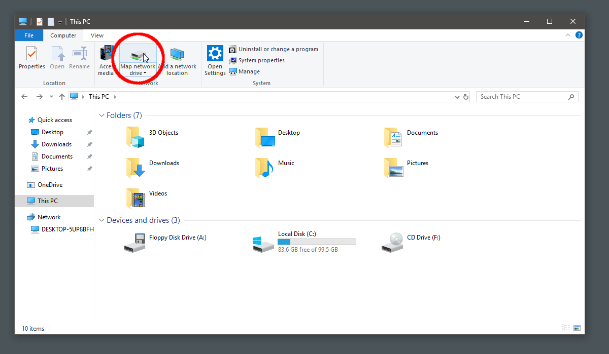
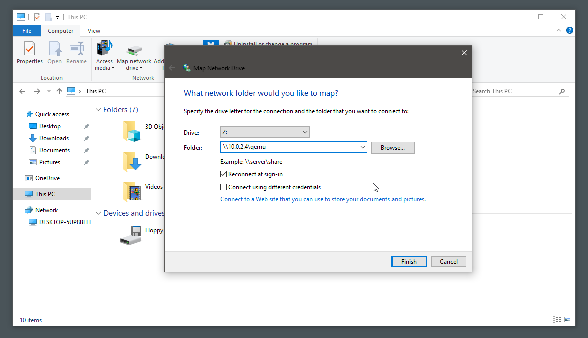
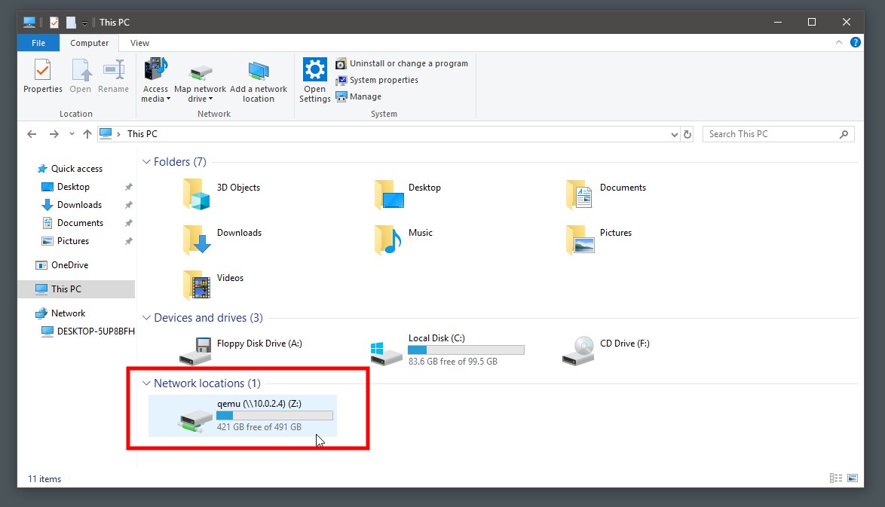

# QEMU - Sharing folders between Linux Host and Windows Guest #

### 05/13/2018 ###

In this post we will take a quick look on how to share a folder between a Linux Host and a Windows Guest within a QEMU environment. 

## [](#startup-script)Startup Script
### [](#samba)Samba
QEMU uses Samba for sharing folders and files between hosts and guests. We activate the Samba Server on the host using the `-net user,smb=/absolute/path/to/folder` switch.
### [](#windows-10-sh)windows-10.sh
We supply our guest withg 2 CPUs and 4GB of RAM. 
The complete startup script is as follows:

```bash
#!/bin/sh
exec qemu-system-x86_64 -enable-kvm \
        -cpu host \
        -smp 2 \
        -enable-kvm \
        -drive file=windows-10.img,if=virtio \
        -net nic -net user,hostname=windows10vm,smb=/absolute/path/to/folder \
        -m 4G \
        -monitor stdio \
        -name "windows" \
        $@ 
```

### [](#first-run)First Run
When running the guest for the first time, we have to install the [_virtio_ drivers for Windows](https://docs.fedoraproject.org/quick-docs/en-US/creating-windows-virtual-machines-using-virtio-drivers.html).
To achieve this on Arch-Linux we do a simple `yaourt -S virtio-win` and call our script as follows:
```bash
./windows-10.sh -boot d -drive file=/path/to/win/image.iso,media=cdrom -drive file=/usr/share/virtio/virtio-win.iso,media=cdrom
```
Now we have to install the appropriate driver for our system to recognize the HDDs.

## [](#accessing-samba-shares)Accessing Samba Shares
### [](#mapping-network-drive)Mapping Network Drive
To easily map a network drive, we go to _This PC_ and click on _Map network drive_:



Then, we put the hosts adress with a QEMU-suffix to the folder text box - `\\10.0.2.4\qemu`:



Click on finish and we have our connected Samba drive:



And this is it! Now we're ready to share files between our Linux Host and our Windows Guest and vice versa.

## [](#conclusion)Conclusion
In this post we covered howto share files between virtual machines based on QEMU. We wrote a little startup script, which spawns a Samba Server and mapped a network drive to the share. 
